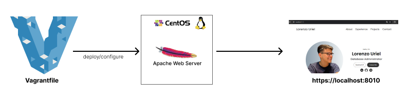

# Objetivo
O objetivo deste projeto é **automatizar a implantação e deploy de uma aplicação ou um site em um servidor Web Apache**, utilizando o Vagrant para criar e configurar uma máquina virtual CentOS.

# Desafios e Soluções
### Qual o problema?
- A necessidade de instalar e configurar o Apache Web Server manualmente na máquina virtual CentOS.
- Transferir os arquivos da aplicação para o diretório correto no servidor Apache Web Server manualmente.
- Iniciar manualmente o Apache Web Server após a configuração.

### Seu trabalho para resolver?
- Instalação do Apache Web Server em um arquivo de provisionamento no Vagrant.
- Inicialização do Apache Web Server e configuração do centos/7 com o Vagrant.

### Qual foi o resultado?
- O Apache Web Server é instalado automaticamente na máquina virtual CentOS.
- Os arquivos da aplicação são copiados para o diretório correto no Apache Web Server.
- O Apache Web Server é iniciado, tornando a aplicação acessível através do servidor web.

# Etapas
Se você está começando um novo projeto e deseja configurar um ambiente de desenvolvimento com o Vagrant e o servidor web Apache, siga as etapas abaixo:

1. Inicie o seu projeto criando um repositório Git e, em seguida, utilize o comando abaixo para criar um arquivo de configuração Vagrantfile:
``vagrant init``. 
    - O comando ``vagrant init`` cria um Vagrantfile básico que pode ser personalizado para atender às suas necessidades.
2. No Vagrantfile, adicione a configuração da máquina virtual desejada. Para Apache Web Server, recomendamos o uso de distribuições Linux. Caso prefira utilizar o Windows, é necessário configurar o IIS Web Server.
3. Copie os arquivos da sua aplicação para o diretório do projeto.
4. Personalize o script de provisionamento para configurar o Apache Web Server e implantar sua aplicação. Exemplo de um trecho que instala o Apache e copia os arquivos da aplicação:
````
#!/usr/bin/env bash
echo "Installing Apache and Setting it up..."
yum install -y httpd >/dev/null 2>&1
cp -r /vagrant/lorenzo-portfolio/* /var/www/html/
service httpd start
````
5. Finalmente, inicie a VM com o comando: ``vagrant up``
6. Você pode testar acessando o ``https://localhost:8010``
    - 

# Ferramentas / Tecnologias
- Vagrant
- Apache Web Server
- CentOS/7

# Arquitetura


---
---
---

# Objective
The objective of this project is to **automate the deployment and deployment of an application or a website on an Apache Web server**, using Vagrant to create and configure a CentOS virtual machine.

# Challenges and Solutions
### What was the problem?
- The need to manually install and configure the Apache web server on the CentOS virtual machine.
- Manually transfer the application files to the correct directory on the Apache Web Server.
- Manually start the Apache Web Server service after configuration.

### Your job to solve?
- Apache Web Server installation in a provisioning file in Vagrant.
- Apache Web Server startup and configuration of centos/7 with Vagrant.

### What was the result?
- Apache Web Server is installed automatically on the CentOS virtual machine.
- Application files are copied to the correct directory on the Apache Web Server.
- The Apache Web Server is started, making the application accessible through the web server.

# Steps
If you are starting a new project and want to set up a development or testing environment with Vagrant and the Apache web server, follow the steps below:

1. Start your project by creating a Git repository and then use the command below to create a Vagrantfile configuration file:
``vagrant init``   
    - The ``vagrant init`` command creates a basic Vagrantfile that can be customized to meet your needs. 
2. In the Vagrantfile, add the configuration of the desired virtual machine. For Apache Web Server, we recommend using Linux distributions. If you prefer to use Windows, you need to configure the IIS Web Server.

3. Copy the files from your application to the project directory.

4. Customize the provisioning script to configure Apache Web Server and deploy your application. Example that installs Apache and copies application files:
````
#!/usr/bin/env bash
echo "Installing Apache and Setting it up..."
yum install -y httpd >/dev/null 2>&1
cp -r /vagrant/lorenzo-portfolio/* /var/www/html/
service httpd start
````
5. Finally, start the VM with the command: ``vagrant up``
6. You can test by accessing the ``https://localhost:8010``
    - 

# Tools / Technology
- Vagrant
- Apache Web Server
- CentOS/7

# Architecture
